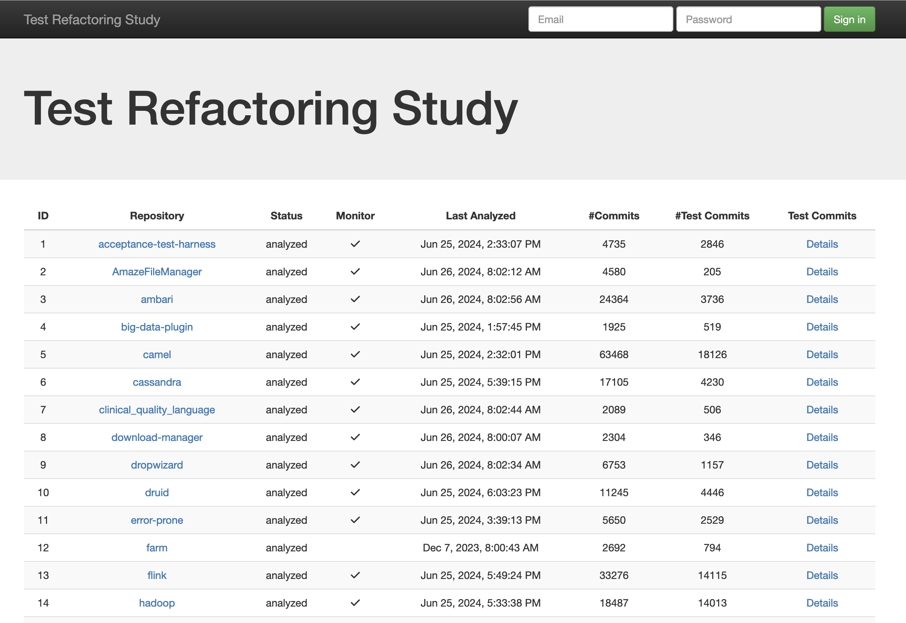
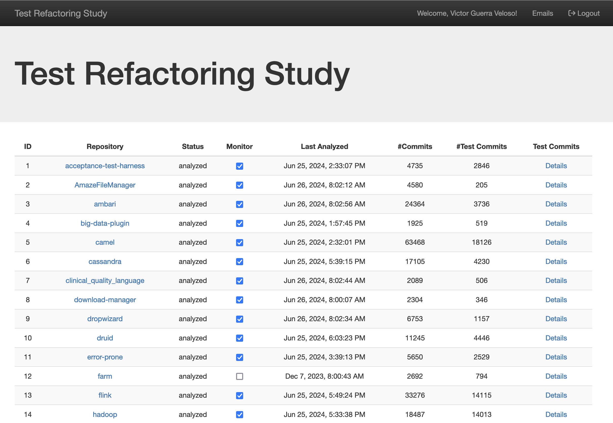
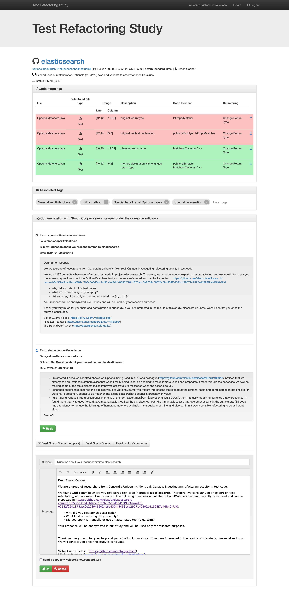
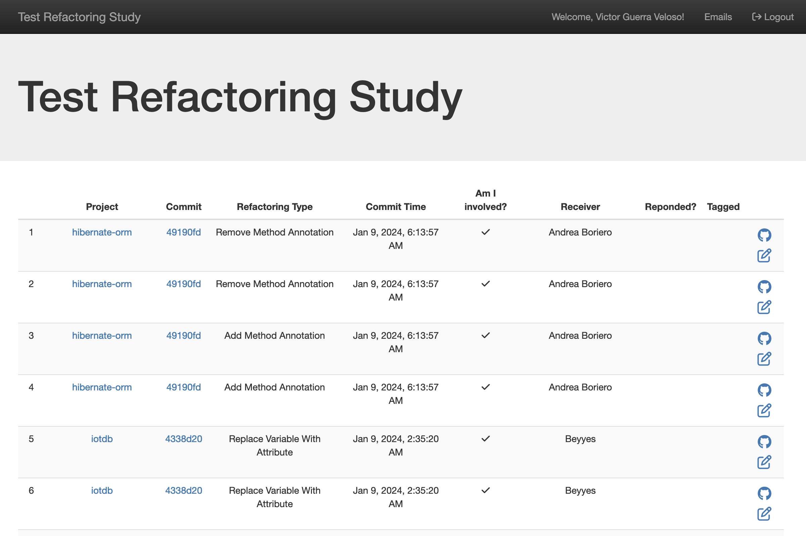

# First steps

1. Clone the repository

```bash
git clone https://github.com/victorgveloso/RefactoringMonitor --recursive
```

## (Optional) Change Database settings

1. Open `docker-copmose.yml` and edit lines 28-31:

```
      MYSQL_ROOT_PASSWORD: secret
      MYSQL_DATABASE: refactoring
      MYSQL_USER: myuser
      MYSQL_PASSWORD: mypassword
```

2. Replace the credentials and database name as you prefer.

3. When you are done, save the file and update the each service that access the database.

   1. To update the database name used by the API, edit the file `PHP.env` in the root directory.
   2. To update the database credentials used by the API, edit line 12 of the file `/api/src/api.php` (where `$globalConnection` is defined)
   3. To update the database name and credentials used by the workers, edit lines 28-30 of the file `/worker/RefactoringMiner/src/main/resources/META-INF/persistence.xml`, and compile the project

4. Update the worker settings so it access the database

## Starting API, WebApp, and Database with Docker

1. After cloning the repository and setting up the database credentials and name, you only need to start the services with the command:

```bash
docker-compose up -d --build
```


## Starting worker

1. Confirm the database URL and credentials are correctly set (lines 28-30 of the file `/worker/RefactoringMiner/src/main/resources/META-INF/persistence.xml` shoud look like the following code snippet except it should contain your chosen credentials and name)
```xml
            <property name="javax.persistence.jdbc.url" value="jdbc:mysql://localhost:3306/refactoring?useSSL=false" />
            <property name="javax.persistence.jdbc.user" value="root" />
            <property name="javax.persistence.jdbc.password" value="secret" />
```

2. Compile RefactoringMiner using `./gradlew jar`

**Attention: Java 20 or later is recommended**

3. Copy the resulting jar from `/worker/RefactoringMiner/build/libs/RefactoringMiner-3.0.2.jar` to `/worker` using the following command

```bash
$ cp /worker/RefactoringMiner/build/libs/RefactoringMiner-3.0.2.jar /worker/RefactoringMiner.jar
```

**Attention: If the resulting jar file has a different name or version, just use it and report a bug**

4. Run `/worker/start_worker.sh`

```bash
$ cd worker
$ chmod a+x start_worker.sh
$ ./start_worker.sh
```

5. Navigate through the options in the interactive menu.

## Create a new user in the API

In the same machine all the services are running, open your browser and access the following URL:

`http://localhost:8080/api.php?signup&u=EMAIL&p=PASSWORD`

Replace EMAIL and PASSWORD with your credentials.

## Done

Now everything is set and running. If you want, you can login in the webapp by filling the fields in the top-right corner of the main page with your credentials.



When authenticated, the log-in fields will be replaced with a welcome message and two buttons (emails and logout).
Use the former to check all emails sent that were stored in the database.
When you are done using the webapp, remmember to use the second button in the navigation header bar to log out your session.




## Toggling repository monitoring status

By default, any repository added with a RefactoringMonitor worker will have the monitor checkbox unmarked. One has to explicitly mark the Monitor checkbox so that repository is scheduled for monitoring in the next execution of a worker.

## Inspecting specific repository


## Inspecting specific refactoring



## Contacting commit author

## Storing author's response

## Tagging commit

## Browsing emails exchanged



## Closing and pruning services

```
docker-compose down --volumes
```