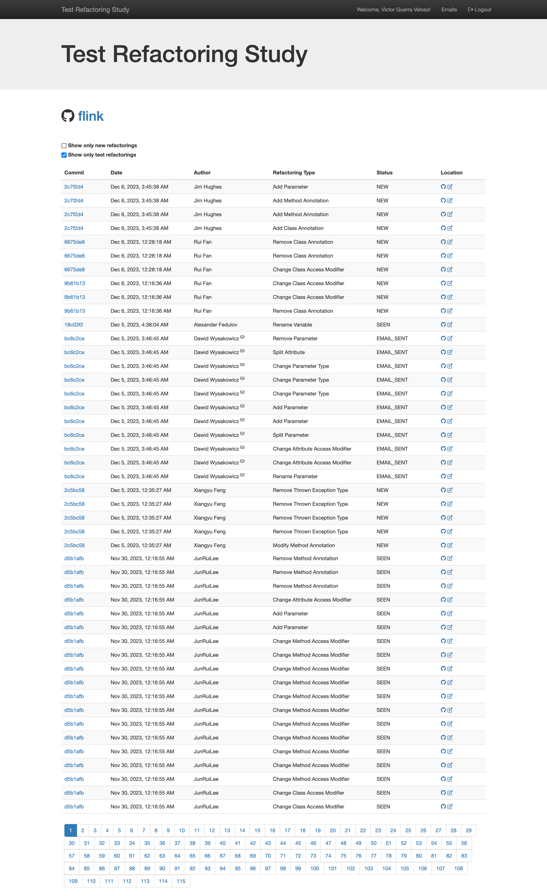
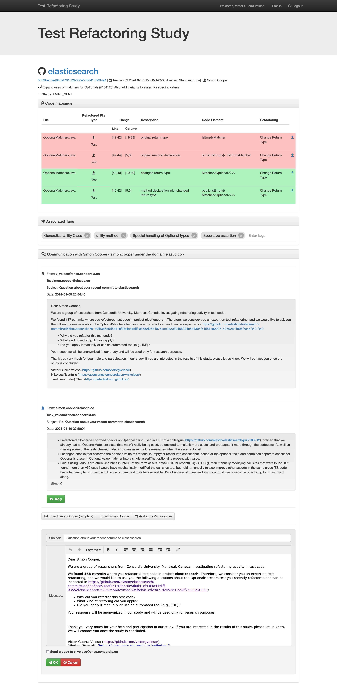

# First steps

1. Clone the repository

```bash
git clone https://github.com/victorgveloso/RefactoringMonitor --recursive
```

## (Optional) Change Database settings

1. Open `docker-copmose.yml` and edit lines 28-31:

```
      MYSQL_ROOT_PASSWORD: secret
      MYSQL_DATABASE: refactoring
      MYSQL_USER: myuser
      MYSQL_PASSWORD: mypassword
```

2. Replace the credentials and database name as you prefer.

3. When you are done, save the file and update the each service that access the database.

   1. To update the database name used by the API, edit the file `PHP.env` in the root directory.
   2. To update the database credentials used by the API, edit line 12 of the file `/api/src/api.php` (where `$globalConnection` is defined)
   3. To update the database name and credentials used by the workers, edit lines 28-30 of the file `/worker/RefactoringMiner/src/main/resources/META-INF/persistence.xml`, and compile the project

4. Update the worker settings so it access the database

## Starting API, WebApp, and Database with Docker

1. After cloning the repository and setting up the database credentials and name, you only need to start the services with the command:

```bash
docker-compose up -d --build
```


## Starting worker

1. Confirm the database URL and credentials are correctly set (lines 28-30 of the file `/worker/RefactoringMiner/src/main/resources/META-INF/persistence.xml` shoud look like the following code snippet except it should contain your chosen credentials and name)
```xml
            <property name="javax.persistence.jdbc.url" value="jdbc:mysql://localhost:3306/refactoring?useSSL=false" />
            <property name="javax.persistence.jdbc.user" value="root" />
            <property name="javax.persistence.jdbc.password" value="secret" />
```

2. Compile RefactoringMiner using `./gradlew jar`

**Attention: Java 20 or later is recommended**

3. Copy the resulting jar from `/worker/RefactoringMiner/build/libs/RefactoringMiner-3.0.2.jar` to `/worker` using the following command

```bash
$ cp /worker/RefactoringMiner/build/libs/RefactoringMiner-3.0.2.jar /worker/RefactoringMiner.jar
```

**Attention: If the resulting jar file has a different name or version, just use it and report a bug**

4. Run `/worker/start_worker.sh`

```bash
$ cd worker
$ chmod a+x start_worker.sh
$ ./start_worker.sh
```

5. Navigate through the options in the interactive menu.

### Routinely run worker by setting up cronjob (Optional)

In the terminal, run:
```bash
$ crontab -e
```

Your favorite editor should be revealed. Navigate to the end of the file and create another line with the following text:
```bash
0 8 * * * cd /home/victor/University/PhD/RMLighthouseMonitor/Run && java -DLOG_FILE="Monitor-LogFile" -cp RefactoringMiner-3.0.2.jar -Dlogback.configurationFile=logback.xml br.ufmg.dcc.labsoft.refactoringanalyzer.operations.AnalyzeNewCommits
```

## Create a new user in the API

In the same machine all the services are running, open your browser and access the following URL:

`http://localhost:8080/api.php?signup&u=EMAIL&p=PASSWORD`

Replace EMAIL and PASSWORD with your credentials. Once completed, your account will be created unless an error message is provided in the server response.

## Authentication and front page

Now everything is set and running. If you want, you can login in the webapp by filling the fields in the top-right corner of the main page with your credentials.


When authenticated, the log-in fields will be replaced with a welcome message and two buttons (emails and logout).
Use the former to check all emails sent that were stored in the database.
When you are done using the webapp, remmember to use the second button in the navigation header bar to log out your session.


The following sections demonstrate how to perform one of the four supported tasks in RefactoringMonitor:

- [Manage repository commit monitoring](#toggling-repository-monitoring-status)
- [Discover refactorings found in a specific repository](#inspecting-specific-repository)
- [Contact the author of detected refactorings](#contacting-commit-author)
- [Tag detected refactorings](#tagging-commit)

## Toggling repository monitoring status

By default, any repository added with a RefactoringMonitor worker will have the monitor checkbox unmarked. One has to explicitly mark the Monitor checkbox so that repository is scheduled for monitoring in the next execution of a worker.

## Inspecting specific repository

The repository details page allows users to filter the displayed refactorings using two checkboxes: "Show only new refactorings" and "Show only test refactorings." These options help in narrowing down the displayed data to the user's specific interests.

The main section of the webpage presents a table listing the details of each refactoring detected in the selected project. The columns include:

- **Commit**: Displays the commit hash (e.g., `2c7f9d4`).
- **Date**: Shows the date and time of the commit (e.g., Dec 6, 2023, 3:45:38 AM).
- **Author**: Lists the name of the author who made the commit (e.g., Jim Hughes).
- **Refactoring Type**: Describes the type of refactoring performed (e.g., Add Parameter).
- **Status**: Indicates the status of the refactoring (i.e., NEW, SEEN, EMAIL_SENT, and AUTHOR_CONTACTED).
  - NEW: this refactoring was committed after your last review
  - SEEN: your account has already reviewed a more recent commit from this project
  - EMAIL_SENT: the commit author has been contacted about this refactoring
  - AUTHOR_CONTACTED: An email has already been sent to this commit's author
- **Location**: Provides links to GitHub's commit diff or the webapp's refactoring detail page.

To navigate through multiple pages of refactorings, use the pagination buttons at the bottom of the table, which allow access to various pages (e.g., 1, 2, 3,...108). Additionally, clicking on a column header will sort the entire table based on that column.





## Inspecting specific refactoring

The refactoring details page allows users to gain an in-depth understanding of a specific refactoring within a project. The main section of the page is dedicated to a detailed table that lists the following information for each refactored element:

- **File**: Shows the name of the file where the refactoring took place (e.g., `MyClass.java`).
- **Type**: Indicates the type of file (e.g., `Java`).
- **Range**: Specifies the line and column range affected by the refactoring (e.g., `10-20, 1-15`).
- **Description**: Provides a brief description of the refactoring (e.g., `Change Return Type`).
- **Code Element**: Lists the specific code elements that were refactored (e.g., `methodName`).
- **Details**: Links to the refactored code diff on GitHub, facilitating easy access to the source code and detailed diffs.

The table also includes visual indicators, such as background colors, to highlight the nature of changes. For example, added lines may be marked with a green background, while removed lines might be marked with red.

### Additional Features:

- **Refactoring Tags**: Users can add tags to specific refactorings, aiding in the organization and searchability of changes.
- **Commit Information**: Displays relevant commit details, including the hash, date, time, and author of the commit. This information provides context for the refactoring (See [Tagging commit](#tagging-commit)).
- **Communication Panel**: A section where users can interact with the commit author, enabling direct collaboration and discussion about the refactoring (See [Contacting commit author](#contacting-commit-author) and [Storing author's response](#storing-authors-response)).
- **Navigation Links**: Provides links to navigate back to the project overview or to other related commits, ensuring seamless movement within the application.

To further assist in managing the inspection process, users can utilize the filtering options available on the page. For instance, they can choose to view only new refactorings or specific types of changes, tailoring the displayed information to their needs.

### Example of Refactoring Detailed View:



This detailed inspection capability ensures that users have all the necessary information to understand, review, and collaborate on code refactorings within their projects.

## Contacting commit author

To contact the commit author about a detected refactoring, follow these steps:

- Navigate to the refactoring details page of the specific refactoring you want to discuss.
- Reveal the communication panel by pressing the `Email... (template)` button.
- Use the provided template to write an email and directly contact the commit author.

RefactoringMonitor will update the "Status" field in the refactoring details table to reflect the reviewing status (e.g., "EMAIL_SENT", "AUTHOR_CONTACTED").

## Storing author's response

To store the author's response regarding a detected refactoring:

- Check your email inbox regularly for responses from commit authors.
- Reveal the communication panel by pressing the `Add author's response` button.
- Document any relevant details based on the received author's response.

## Tagging commit

To tag a detected refactoring commit for organizational purposes:

- Navigate to the refactoring details page of the specific refactoring you want to tag.
- Use the tagging field provided in the UI to assign relevant tags or labels to the refactoring by typing directly.
- Press enter when you are satisfied with the name of your new tag.
- Alternatively, choose an option in the autocomplete feature to reuse an existing tag.

## Browsing emails exchanged

To view emails exchanged using RefactoringMonitor, follow these steps:

1. **Accessing the "Emails" Section**: Navigate to the "Emails" section within the RefactoringMonitor web application. This section serves as a centralized hub for managing all communications related to detected refactorings and commit activities.

2. **Browsing Through Emails**: Utilize the intuitive interface provided to browse through all emails sent and received. Each email entry includes details such as the subject, date of exchange, and the associated commit or refactoring. This feature facilitates comprehensive tracking and documentation of all communication threads.

3. **Maintaining Communication Records**: Use this feature to maintain a complete and organized record of communications throughout the experiment or project lifecycle. This ensures transparency, facilitates collaboration among team members, and provides a historical reference for tracking project progress and decisions made during the refactorings.

By leveraging the "Emails" section in RefactoringMonitor, teams can effectively manage and document all email exchanges, promoting efficient project management and streamlined communication practices.

### Key Features

**Email Listing**: The main interface displays a comprehensive list of emails exchanged with commit authors. Each entry includes details such as the email subject, date of exchange, and the associated commit or refactoring.

**Status Tracking and Assigned User**: Emails are categorized based on their status, indicating whether they have been sent, received, or responded to.

- **Am I Involved**: Indicates emails that you are directly involved in, ensuring you can quickly identify your participation in communications.
- **Tagged**: Marks emails that have been tagged with specific labels or categories for better organization and retrieval.
- **Responded**: Flags emails where responses have been provided, ensuring follow-up actions are tracked effectively.

**Integration with Commit Details**: Emails are linked to specific commits or refactorings within the system. This integration allows users to directly access relevant commit details or refactoring information from the email interface.

**Usage Tips**: To effectively utilize the email browsing feature; Utilize sorting and filtering options to focus on critical communications or pending responses.


## Closing and pruning services
To shut down and clean up services:

- Run the following command in your terminal:
`docker-compose down --volumes`
(This command stops and removes containers, networks, volumes, and images created by docker-compose up)

These steps should help you complete the missing sections in your README.md file effectively.
